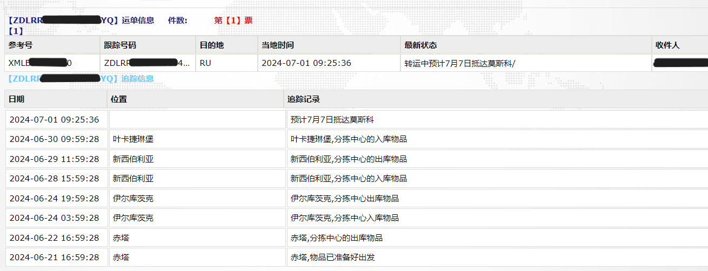
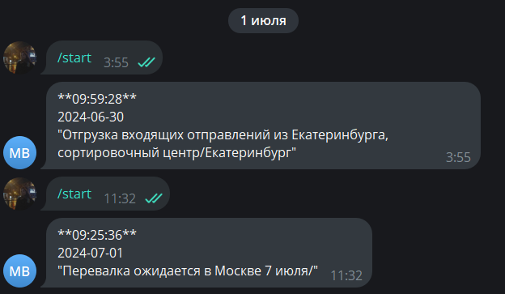

# tracking bot

## Описание

Бот создан для отслеживания моей посылки с Aliexpress. Данные о посылке берутся с сайта 
[zd express](http://118.24.145.30:8082/trackIndex.htm) POST-запросом, 
обрабатываются bs4 и переводятся с помощью библиотеки translate.\
Стек: aiogram, bs4, translate, requests. \
Используется файл `.env` для хранения конфигурационных данных.

## Установка

Следуйте инструкциям ниже для установки и запуска проекта локально.

### Шаги установки

1. Клонируйте репозиторий

   ```bash
   git clone https://github.com/jaam8/tracking_bot.git
   cd tracking_bot
   ```

2. Создайте и активируйте виртуальное окружение

3. Установите зависимости

   ```bash
   pip install -r requirements.txt
   ```

5. Настройте файл окружения

   Скопируйте файл `.env.example` в `.env` и отредактируйте его, добавив свои значения.

   ```bash
   cp .env.example .env
   ```

   содержание файла .env
   ```ini
   BOT_TOKEN=YOUR_BOT_TOKEN
   TRACK_NUMBER_ZD=TRACK_NUMBER
   ```

## Использование
[бот находится здесь](https://t.me/jam_study_bot)

